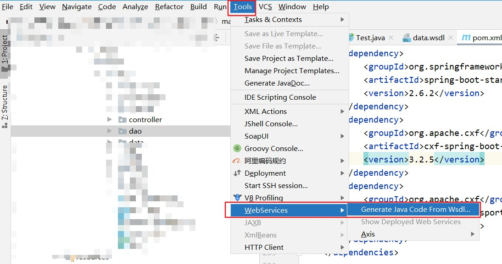

# 数据接收服务

## 简介

本服务支持从源库（支持DB、rest、webService）主动获取数据；提供REST和WebService接口，可供业务系统调用，被动接收数据。数据获取后，经过加工存入目标库指定的数据表中。

本服务可用于数据接收、数据同步。

## 启动

### 运行环境

`jdk8`, `maven`

### 启动步骤

1. 依赖编译，项目根目录下执行 `mvn clean package`
2. 启动服务，start 项目target目录下 执行 `java -jar start.jar`

## start 服务配置说明

application.yml

```yaml

# 非必须， xml配置文件目录, linux配置示例：/app/conf
xml:
  path: D:/conf

# 非必须， 数据同步日志目录, linux配置示例：/app/log/
logging:
  file:
    path: D:/log/
```

## XML配置说明

### 配置文件目录

系统中的数据库连接、数据Mapping设置，均存放于XML文件中。系统自动定时(每隔10s)扫描配置文件目录（conf）下的`*.xml`文件是否发生变化，如果检测到发生变化，则自动同步调度任务的设置。

- 默认路径：{运行目录}/conf/

- 可指定目录：

    - 启动命令中加入参数 `xml.path=D:/conf`。如：java -jar -Dxml.path=D:/conf start.jar
    - 修改项目配置文件application.yml中的设置： `xml.path=D:/conf`

### 配置文件说明

#### 配置文件示例

```xml
<?xml version="1.0" encoding="UTF-8"?>
<!--cron 在接收REST API和WebSocket数据时不需要配置, 其他情况必须配置！
    blnRunning: 设置为 false 则停用同步任务
-->
<task cron="0 0/1 * * * ? " blnRunning="true">
    <!-- name: 数据源名称，必填
    blnRestReceive： 是否接收REST API数据 -->
    <from name="source" blnRestReceive="false">
        <!-- 数据库连接配置，无固定key,
		blnRestReceive为true时（即接收REST API数据），properties为空（没有源数据库需要连接）  -->
        <properties>
            <name>fromDataSource</name>
            <driver-class-name>com.mysql.cj.jdbc.Driver</driver-class-name>
            <url>jdbc:mysql://192.168.2.250:3306/ecology_base?serverTimezone=UTC</url>
            <username>ecology</username>
            <password>Weaver_2021</password>
        </properties>
        <dicts>
            <!--name\sql\key\value 都必填, 无字典项请使用 <dicts/>-->
            <dict name="dict1" sql="select id, name from user " key="id" value="name"/>
        </dicts>
    </from>
    <!-- name: 数据目标名称 -->
    <to name="target">
        <!-- db连接配置，无固定key， 
		暂不支持非结构化数据存储 -->
        <properties>
            <name>toDataSource</name>
            <driver-class-name>com.mysql.cj.jdbc.Driver</driver-class-name>
            <url>jdbc:mysql://192.168.2.250:3306/ec?serverTimezone=UTC</url>
            <username>ecology</username>
            <password>Weaver_2021</password>
        </properties>
    </to>
    <!--同步的所有表-->
    <tables>
        <!--必填： name: 源表表名 | sourceId：源表表ID | targetName: 目标表表名 |targetId：目标表ID字段
        非必填字段：whereCondition：源表查询条件，大于小于需要转义 | parentTable： 父表表名 | targetParentId：目标库中， 子表中父表ID字段（pid）
        | blnUpdateData： 是否更新现有数据-->
        <table name="hrmresource" targetName="hrmresource_copy" whereCondition="id &lt; 100" targetId="id">
            <fields>
                <!--必填：targetName：目标字段名 | targetType：目标字段类型
                非必填：name： 源表字段名 | type: 源表字段类型 | handleType：数据处理类型 | handleExpress: 数据处理表达式，具体配置见readme.md
                incrementalField： 增量字段，建议一个表只配置一个 |
                parentCountField：父表汇总字段 | parentSumField：父表求和字段 ， 需配合父表表名一起使用 -->
                <field name="ID" type="int" targetName="ID" targetType="int" incrementalField="true"/>
            </fields>
        </table>
    </tables>
</task>
```

#### 数据源相关标签说明

1. `task`：同步任务标签，根节点，必须配置，一个文件只能有一个
    1. `cron`: cron表达式，可参照 [在线cron表达式配置](https://cron.qqe2.com/) 进行配置，不配置则无法进行定时同步操作
    2. `blnRunning`: 是否运行，只有在配置为“true”时才会执行
2. `from`: 数据来源配置
    1. `name`: 数据来源库名称，必须配置，建议英文+数字
    2. `blnRestReceive`：是否接收外部数据，默认false；为true时，`properties`可不配置
    3. `peoperties`: 数据库连接配置，`blnRestReceive`不为true时必须配置，配置示例如下：
        1. mysql: `<name>db1</name>
           <driver-class-name>com.mysql.cj.jdbc.Driver</driver-class-name>
           <url>jdbc:mysql://****:3306/******?serverTimezone=UTC</url>
           <username>***</username>
           <password>***</password>`
        2. sqlserver: `<driver-class-name>com.microsoft.sqlserver.jdbc.SQLServerDriver</driver-class-name>
           <url>jdbc:sqlserver://*********;DatabaseName=******</url>
           <username>******</username>
           <password>******</password>`
        3. ...
    4. `dicts`: 字典表根节点配置，必须配置，无字典表时配置`<dicts/>`
    5. `dict`: 字典表配置
        1. `name`：字典表别名，必须配置
        2. `sql`: 查询sql，查询字段需包含`key`、`value`字段，必须配置
        3. `key`: 字典项key，必须配置
        4. `value`： 字典项value，必须配置
3. `to`: 目录数据库配置
    1. `name`: 目标数据库名称，必须配置，建议英文+数字
    2. `properties`: 数据库连接配置，必须配置，详情请参考`from.properties`

#### 表相关标签说明

1. `tables`: 同步表根节点，必须配置，一个文件只能有一个
2. `table`: 同步的单表配置
    1. `name`: 来源数据表名，接收rest或webService数据时需要与传递参数一致,必须配置
    2. `sourceId`: 来源表ID字段,必须配置
    3. `whereCondition`: 来源表查询条件,需对值进行转义，见 [xml转义](https://www.usetoolbar.com/convert/xml_escape.html) ，例： `id &lt 100`
    4. `targetName`: 目标表表名,必须配置
    5. `targetId`: 目标表ID字段,必须配置
    6. `targetOldId`: 目标表中旧ID字段,必须配置
    7. `targetParentId`: 目标库中， 子表中与父表关联的字段（new pid）
    8. `targetOldParentId`: 目标库中， 子表中旧父表关联的字段（old pid）
    9. `blnUpdateData`: 是否更新现有数据，`true | false`, 为 true 时，如果源数据库数据与目标库数据不一致时，更新目标数据库数据
    10. `parentTable`: 目标库中父表表名
3. `fields`： 字段根节点，必须配置
    1. `field`： 字段配置
        1. `name`: 源表字段名，不通过源数据库获取字段可不配置
        2. `type`：源表字段类型，支持`string`、`varchar`、`char`、`integer`、`int`、`double`...
        3. `incrementalField`: 是否是源表增量字段, `true | false`,默认`false`, 建议单表只添加一个增量字段，用于查询过滤
        4. `targetName`: 目标字段名，必须配置
        5. `targetType`: 目标字段类型，必须配置，见`field.type`
        6. `handleType`: 数据加工类型，具体配置见 <a href="#handleContent" >数据加工说明</a>
        7. `handleExpress`: 数据加工表达式，具体配置见 <a href="#handleContent" >数据加工说明</a>
        8. `parentCountField`: 父表计数字段名，需配合`table.parentTable`使用
        9. `parentSumField`：父表求和字段名，需配合`table.parentTable`使用

#### <a id="handleContent">数据加工说明</a>

| handleType                      | 说明                                                               |配置说明| 是否验证| 示例配置                                                                                                                                                                            |
|----------|------------------------------------------------------------------|----|----|---------------------------------------------------------------------------------------------------------------------------------------------------------------------------------|
| NONE     | 不处理, 固定内容，如`del_flag: 0`                                         |handleType可不配置| 是 | `<field targetName="password" targetType="varchar" handleExpress="123456"/>`<br/>`<field targetName="password" targetType="varchar" handleType="NONE" handleExpress="123456"/>` |
| FILE     | 附件字段，当前仅可处理http类型的附件字段                                         |handleExpress配置为空| 是 | `<field name="file" type="varchar" targetName="file_path" targetType="varchar" handleType="FILE" handleExpress=""/>` |
| CONSTANT  | 系统常量，获取系统时间、日期等, 见<a href="#constant" >系统常量说明</a>                | | 是 | `<field targetName="createDate" targetType="varchar" handleType="CONSTANT" handleExpress="SIMPLE_DATE"/>`                                                                       |
| JSON      | 当单个字段的内容为json时，可以使用jsonPath匹配获取json字符串中的内容，匹配到多值抛出异常                                          | | 是 |  `<field name="info" type="string" targetName="email" targetType="varchar" handleType="JSON" handleExpress="$..email"/>` 
| XML       | 当单个字段的内容为xml时，可以使用xPath匹配获取xml字符串中的内容，匹配到多值抛出异常                                               | | 是 |  `<field name="info" type="string" targetName="email" targetType="varchar" handleType="XML" handleExpress="/root/email"/>` 
| REGEXP    | 正则表达式获取数据                                                        |  | 是 |  `<field name="type" type="string" targetName="type" targetType="varchar" handleType="REGEXP" handleExpress="电子凭证`\|`纸质凭证"/>`
| QL_EXPRESS| QL表达式，只支持目标表字段，表达式参数需配置在该字段之前，见<a href="#qlExpress" >QL表达式说明</a> |handleExpress必须配置，所用字段取目标表表名 | 是 | `<field targetName="percentage" targetType="varchar" handleType="QL_EXPRESS" handleExpress="num / 100 + '%' "/>`                                                                |
| DICT     | 字典项配置【(dict.name).(dict.key)】                                               | handleExpress必须配置， 格式：【字典表别名.字典表key】   | 是 | `<field targetName="companyName" targetType="varchar" handleType="DICT" handleExpress="dict1.companyId"/>`                                                                         |

#### <a id="constant">系统常量</a>

| 表达式                  | 说明   | 示例值                               |
|----------------------|------|-----------------------------------|
| SIMPLE_DATE          | 日期   | 20211228                          |
| SIMPLE_TIME          | 时间   | 160823                            |
| NORM_DATETIME_FORMAT | 标准时间 | 2021-12-28 16:08:23               |
| NOW_SECOND_INT       | 当前秒  | 1640678991                        |
| SIMPLE_UUID          | uuid,不含- | 78C4D0187D1E447C9042A8F6B7692D24  |
| UUID          | uuid | 78C4D018-7D1E-447C-9042-A8F6B7692D24  |

#### <a id="qlExpress">QL表达式</a>

**<font color="red">所用字段来自目标表， 所用字段需要配置在该字段之前</font>**

表达式使用 [QL表达式](https://github.com/alibaba/QLExpress/blob/master/README.md) , 相同优先级时从左向右计算, 简要示例如下，

| 表达式                                       | 说明      | 示例值                                          |
|-------------------------------------------|---------|----------------------------------------------|
| num(int) / days(int)                      | 数值计算    | 100/5 = 20                                   |
| firstName(string) + '.' + lastName(string) | 字段拼接    | 张 + . + 三 = 张.三                              |
| int1(int) + int2(int) + str1(string)      | 不同类型计算  | 100 + 20 + 张三 = 120张三                <br/>   |
| str1(string)+ int1(int) + int2(int)       | 不同类型计算  | 张三 + 100 + 20 = 张三10020                <br/> |
| a(int) > b(int) ? a(int) : b(int)         | 三元表达式判断,获取较大的字段 | (100 > 50 ? 100 : 50)  = 100                 |
| a(string) in ('否') ? 0: 1                 | 三元表达式判断,字典表字段值转换   | ('是' == '否' ? 0 : 1)  = 1                  |

#### mysql 转 mysql 示例及说明

```xml
<?xml version="1.0" encoding="UTF-8"?>
<!--启用任务，每天凌晨3点执行-->
<task cron="0 0 3 * * ? " blnRunning="true">
    <!--mysql 转 mysql-->
    <from name="db1">
        <properties>
            <name>from</name>
            <driver-class-name>com.mysql.cj.jdbc.Driver</driver-class-name>
            <url>jdbc:mysql://*****/db1?serverTimezone=UTC</url>
            <username>*******</username>
            <password>*******</password>
        </properties>
        <!--无字典表-->
        <dicts/>
    </from>
    <to name="db2">
        <properties>
            <name>to</name>
            <driver-class-name>com.mysql.cj.jdbc.Driver</driver-class-name>
            <url>jdbc:mysql://*****/db2?serverTimezone=UTC</url>
            <username>*******</username>
            <password>*******</password>
        </properties>
    </to>
    <tables>
        <table name="jsh_msg" targetName="jsh_msg" sourceId="id" targetId="id" targetOldId="id"
               blnUpdateData="true">
            <fields>
                <!--增量字段：update_time, create_user为固定值，uuid为系统常量-->
                <field name="id" type="int" targetName="id" targetType="int"/>
                <field name="title" type="string" targetName="msg_title" targetType="string"/>
                <field name="type" type="string" targetName="type" targetType="string"/>
				<field targetName="create_time" targetType="datetime" handleExpress="NORM_DATETIME_FORMAT" handleType="CONSTANT"/>
                <field name="status" type="string" targetName="status" targetType="string"/>
				<field name="delete_Flag" type="string" targetName="delete_Flag" targetType="string"/>
				<field name="double" type="string" targetName="double" targetType="double"/>
				<field name="float" type="string" targetName="float" targetType="float"/>
            </fields>
        </table>
        <table name="jsh_log" targetName="jsh_log" sourceId="id"
               targetId="id" targetOldId="id" blnUpdateData="true"
               parentTable="jsh_msg" targetParentId="pid" targetOldParentId="pid">
            <fields>
                <!--增量字段：update_time, create_user为固定值，uuid为系统常量-->
                <field name="id" type="int" targetName="id" targetType="int"/>
                <field name="operation" type="string" targetName="operation" targetType="string"/>
                <field targetName="count" targetType="int" parentCountField="count"/>
                <field targetName="create_time" targetType="datetime" handleExpress="NORM_DATETIME_FORMAT" handleType="CONSTANT"/>
            </fields>
        </table>
    </tables>
</task>

```

## 接口说明

### REST API接口说明

接口URL：http://{ip}:{port}/thinkdifferent/data/upload

接口调用方式：POST

传入参数形式：JSON

传入参数示例：<a href="#dataUpload" >传入参数示例</a>

传入参数说明

- taskName: 任务名称，与配置文件名一致
- tableName: 表名，对应配置文件中某个表
- data：对应的表源数据，字段名与`field.name`一致

#### XML配置示例说明

```xml
<?xml version="1.0" encoding="UTF-8"?>
<!--配置任务是否启用，true为启用，false为禁用-->
<task blnRunning="true">
    <!--rest 转 mysql-->
    <!--当blnRestReceive为true时，表示当前配置信息为接口任务-->
    <!--配置接口任务时，无需配置来源库信息，仅保留以下配置即可-->
    <from name="db1" blnRestReceive="true">
        <!--无数据库配置-->
        <properties/>
        <!--无字典表-->
        <dicts/>
    </from>
    <!--配置目标数据库信息-->
    <to name="db2">
        <properties>
            <name>to</name>
            <driver-class-name>com.mysql.cj.jdbc.Driver</driver-class-name>
            <url>jdbc:mysql://127.0.0.1:3306/db2?serverTimezone=UTC</url>
            <username>root</username>
            <password>root </password>
        </properties>
    </to>
    <tables>
        <!--配置接口任务时，由于无源数据库信息，故name和targetName保持一致，同为目标库名称即可-->
        <!--sourceId  targetId  targetOldId  为必须配置项，详细含义参见表相关标签说明-->
        <!--blnUpdateData为true时，会根据id对现有数据进行更新-->
        <table name="jsh_msg" targetName="jsh_msg" sourceId="id" targetId="id" targetOldId="id"
               blnUpdateData="true">
            <fields>
                <!--普通字段仅需要配置以下四个属性-->
                <!--name   type   targetName    targetType，详细含义参见表相关标签说明-->
                <field name="id" type="int" targetName="id" targetType="int"/>
                <field name="title" type="string" targetName="msg_title" targetType="string"/>
                <field name="type" type="string" targetName="type" targetType="string"/>

                <!--创建时间字段为自动生成，所以无需配置name和type属性-->
                <!--创建时间字段使用  数据加工配置，生成yyyy-MM-dd hh:mm:ss格式的时间信息-->
                <!--配置数据加工时，需同时配置handleExpress和handleType属性，详细含义参见表相关标签说明-->
				<field targetName="create_time" targetType="datetime" handleExpress="NORM_DATETIME_FORMAT" handleType="CONSTANT"/>
                <field name="status" type="string" targetName="status" targetType="string"/>
				<field name="delete_Flag" type="string" targetName="delete_Flag" targetType="string"/>
				<field name="double" type="string" targetName="double" targetType="double"/>
				<field name="float" type="string" targetName="float" targetType="float"/>
            </fields>
        </table>
        <!--当同步数据有父子表关联的情况时，可在table标签中添加parentTable  targetParentId  targetOldParentId-->
        <!--其中targetParentId和targetOldParentId是本表中，与父表关联的字段名称-->
        <table name="jsh_log" targetName="jsh_log" sourceId="id"
               targetId="id" targetOldId="id" blnUpdateData="true"
               parentTable="jsh_msg" targetParentId="pid" targetOldParentId="pid">
            <fields>
                <field name="id" type="int" targetName="id" targetType="int"/>
                <field name="operation" type="string" targetName="operation" targetType="string"/>
                
                <!--当父表需要统计本表字段信息时，配置parentCountField为父表的统计字段-->
                <!--以下配置的含义为：统计本表test字段的个数，将统计结果更新到父表的count字段-->
                <field targetName="test" targetType="int" parentCountField="count"/>
                <field targetName="create_time" targetType="datetime" handleExpress="NORM_DATETIME_FORMAT" handleType="CONSTANT"/>
            </fields>
        </table>
    </tables>
</task>
```

#### <a id="dataUpload">接口调用示例</a>

POST http://{ip}:{port}/thinkdifferent/data/upload

Content-Type: application/json

```json
{
  "taskName": "rest", 
  "tableName": "jsh_msg",
  "data": [
    {
      "id": 8,
      "title": "标题1",
      "status": "1",
      "type": "类型1",
      "delete_Flag": "0",
      "double":"1.55",
      "float":"2.3456778"
    }
  ]
}
```

数据正常处理

```json
{
  "flag": true,
  "msg": "SUCCESS"
}
```

异常示例

```json
{
  "flag": false,
  "msg": "taskName不能为空"
}
```

### WebService接口说明

url: http://{ip}:{port}/services/api/thinkdifferent/data

####java调用前准备工作

以idea为例，选择一个空白文件夹，生成wsdl客户端文件


####java调用示例(xml)
```java
public class WebServiceTest {
    public static void main(String[] args) {
JaxWsDynamicClientFactory dcf = JaxWsDynamicClientFactory.newInstance();
        Client client = dcf.createClient("http://127.0.0.1:8888/services/api/thinkdifferent/data?wsdl");
        ObjectMapper mapper = new ObjectMapper();
        try {
            // taskName:    任务名，例：task1
            // tableName:   表名，例：table1
            // contentType: 内容类型，例：XML|JSON
            // content:     内容，例：<?xml...
            Object[] objects = client.invoke("receiveData", "rest", "jsh_msg", "XML", "<?xml version=\"1.0\" encoding=\"UTF-8\" ?><root><data><id>8</id><title>标题二</title>" +
                    "<status>1</status><type>类型1</type><delete_Flag>0</delete_Flag><double>2.131</double><float>4.213213</float></data>"+
                    "<data><id>9</id><title>标题二</title>" +
                    "<status>1</status><type>类型1</type><delete_Flag>0</delete_Flag><double>2.131</double><float>4.213213</float></data></root>");
            System.out.println(mapper.writeValueAsString(objects[0]));
        } catch (java.lang.Exception e) {
            e.printStackTrace();
        }
    }
}
```

####java调用示例(json)
```java
public class WebServiceTest {
    public static void main(String[] args) {
        JaxWsDynamicClientFactory dcf = JaxWsDynamicClientFactory.newInstance();
        Client client = dcf.createClient("http://127.0.0.1:8888/services/api/thinkdifferent/data?wsdl");
        ObjectMapper mapper = new ObjectMapper();

        String json = "[\n" +
                "    {\n" +
                "      \"title\": \"标题1\",\n" +
                "      \"status\": \"1\",\n" +
                "      \"type\": \"类型1\",\n" +
                "      \"delete_Flag\": \"0\",\n" +
                "      \"double\":\"1.55\",\n" +
                "      \"float\":\"2.3456778\"\n" +
                "    },\n" +
                "    {\n" +
                "      \"title\": \"标题1\",\n" +
                "      \"status\": \"1\",\n" +
                "      \"type\": \"类型1\",\n" +
                "      \"delete_Flag\": \"0\",\n" +
                "      \"double\":\"1.55\",\n" +
                "      \"float\":\"2.3456778\"\n" +
                "    }\n" +
                "  ]";
        try {
            // taskName:    任务名，例：task1
            // tableName:   表名，例：table1
            // contentType: 内容类型，例：XML|JSON
            // content:     内容，例：<?xml...
            Object[] objects = client.invoke("receiveData", "rest", "jsh_msg", "JSON", json);
            System.out.println(mapper.writeValueAsString(objects[0]));
        } catch (java.lang.Exception e) {
            e.printStackTrace();
        }
    }
}
```

soapUI请求示例(xml)

```xml

<soapenv:Envelope xmlns:soapenv="http://schemas.xmlsoap.org/soap/envelope/" xmlns:thin="http://thinkdifferent.data.com">
    <soapenv:Header/>
    <soapenv:Body>
        <thin:receiveData>
            <!--任务名:-->
            <taskName>rest</taskName>
            <!--表名:-->
            <tableName>jsh_msg</tableName>
            <!--内容类型:XML|JSON -->
            <contentType>XML</contentType>
            <!--数据内容:-->
            <content>
                <![CDATA[
                <?xml version="1.0" encoding="UTF-8" ?>
                <root>
                    <data>
                        <id>8</id>
                        <title>标题二</title>
                        <status>1</status>
                        <type>类型1</type>
                        <delete_Flag>0</delete_Flag>
                        <double>2.131</double>
                        <float>4.213213</float>
                    </data>
                    <data>
                        <id>9</id>
                        <title>标题二</title>
                        <status>1</status>
                        <type>类型1</type>
                        <delete_Flag>0</delete_Flag>
                        <double>2.131</double>
                        <float>4.213213</float>
                    </data>
                </root>
                ]]>
            </content>
        </thin:receiveData>
    </soapenv:Body>
</soapenv:Envelope>
```

soapUI请求示例(json)

```xml

<soapenv:Envelope xmlns:soapenv="http://schemas.xmlsoap.org/soap/envelope/" xmlns:thin="http://thinkdifferent.data.com">
    <soapenv:Header/>
    <soapenv:Body>
        <thin:receiveData>
            <!--任务名:-->
            <taskName>rest</taskName>
            <!--表名:-->
            <tableName>jsh_msg</tableName>
            <!--内容类型:XML|JSON -->
            <contentType>JSON</contentType>
            <!--数据内容:-->
            <content>
                <![CDATA[
                [
                    {
                      "id": 8,
                      "title": "标题1",
                      "status": "1",
                      "type": "类型1",
                      "delete_Flag": "0",
                      "double":"1.55",
                      "float":"2.3456778"
                    },
                    {
                      "id": 9,
                      "title": "标题1",
                      "status": "1",
                      "type": "类型1",
                      "delete_Flag": "0",
                      "double":"1.55",
                      "float":"2.3456778"
                    }
                  ]
                ]]>
            </content>
        </thin:receiveData>
    </soapenv:Body>
</soapenv:Envelope>
```


返回结果
```xml
<soap:Envelope xmlns:soap="http://schemas.xmlsoap.org/soap/envelope/">
   <soap:Body>
      <ns2:receiveDataResponse xmlns:ns2="http://thinkdifferent.data.com">
         <return><![CDATA[<RespData><message>SUCCESS</message><code>200</code><flag>true</flag><data/></RespData>]]></return>
      </ns2:receiveDataResponse>
   </soap:Body>
</soap:Envelope>
```


#### XML配置示例

```xml
<?xml version="1.0" encoding="UTF-8"?>
<!--配置任务是否启用，true为启用，false为禁用-->
<task blnRunning="true">
    <!--rest 转 mysql-->
    <!--当blnRestReceive为true时，表示当前配置信息为接口任务-->
    <!--配置接口任务时，无需配置来源库信息，仅保留以下配置即可-->
    <from name="db1" blnRestReceive="true">
        <!--无数据库配置-->
        <properties/>
        <!--无字典表-->
        <dicts/>
    </from>
    <!--配置目标数据库信息-->
    <to name="db2">
        <properties>
            <name>to</name>
            <driver-class-name>com.mysql.cj.jdbc.Driver</driver-class-name>
            <url>jdbc:mysql://127.0.0.1:3306/db2?serverTimezone=UTC</url>
            <username>root</username>
            <password>root </password>
        </properties>
    </to>
    <tables>
        <!--配置接口任务时，由于无源数据库信息，故name和targetName保持一致，同为目标库名称即可-->
        <!--sourceId  targetId  targetOldId  为必须配置项，详细含义参见表相关标签说明-->
        <!--blnUpdateData为true时，会根据id对现有数据进行更新-->
        <table name="jsh_msg" targetName="jsh_msg" sourceId="id" targetId="id" targetOldId="id"
               blnUpdateData="true">
            <fields>
                <!--普通字段仅需要配置以下四个属性-->
                <!--name   type   targetName    targetType，详细含义参见表相关标签说明-->
                <field name="id" type="int" targetName="id" targetType="int"/>
                <field name="title" type="string" targetName="msg_title" targetType="string"/>
                <field name="type" type="string" targetName="type" targetType="string"/>

                <!--创建时间字段为自动生成，所以无需配置name和type属性-->
                <!--创建时间字段使用  数据加工配置，生成yyyy-MM-dd hh:mm:ss格式的时间信息-->
                <!--配置数据加工时，需同时配置handleExpress和handleType属性，详细含义参见表相关标签说明-->
				<field targetName="create_time" targetType="datetime" handleExpress="NORM_DATETIME_FORMAT" handleType="CONSTANT"/>
                <field name="status" type="string" targetName="status" targetType="string"/>
				<field name="delete_Flag" type="string" targetName="delete_Flag" targetType="string"/>
				<field name="double" type="string" targetName="double" targetType="double"/>
				<field name="float" type="string" targetName="float" targetType="float"/>
            </fields>
        </table>
        <!--当同步数据有父子表关联的情况时，可在table标签中添加parentTable  targetParentId  targetOldParentId-->
        <!--其中targetParentId和targetOldParentId是本表中，与父表关联的字段名称-->
        <table name="jsh_log" targetName="jsh_log" sourceId="id"
               targetId="id" targetOldId="id" blnUpdateData="true"
               parentTable="jsh_msg" targetParentId="pid" targetOldParentId="pid">
            <fields>
                <field name="id" type="int" targetName="id" targetType="int"/>
                <field name="operation" type="string" targetName="operation" targetType="string"/>
                
                <!--当父表需要统计本表字段信息时，配置parentCountField为父表的统计字段-->
                <!--以下配置的含义为：统计本表test字段的个数，将统计结果更新到父表的count字段-->
                <field targetName="test" targetType="int" parentCountField="count"/>
                <field targetName="create_time" targetType="datetime" handleExpress="NORM_DATETIME_FORMAT" handleType="CONSTANT"/>
            </fields>
        </table>
    </tables>
</task>
```